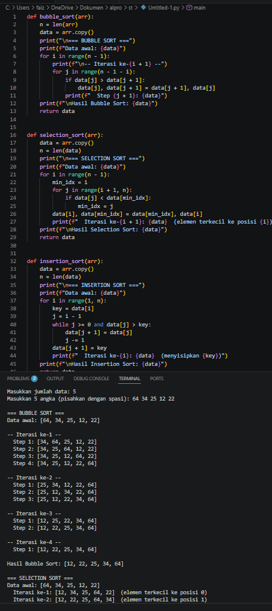

# Tugas Implementasi Algoritma Sorting
Tugas praktikum struktur data menggunakan bahasa Python dan C++.

## Algoritma yang Tersedia:
* Bubble Sort
* Selection Sort
* Insertion Sort
* Quick Sort
* Merge Sort

## Tampilan Demo Aplikasi:

